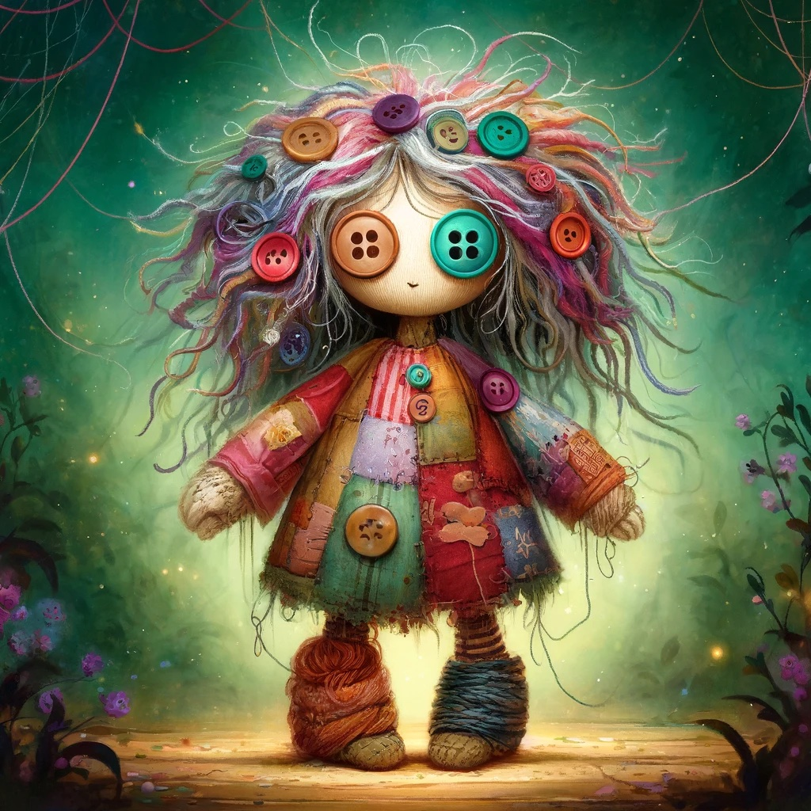

---
tags:
  - npc
  - the-gerbil-kings-quest
title: Tilly Threadbare
layout: post
---

Tilly appears at first glance to be a large, well-loved rag doll. She stands about three feet tall, with mismatched button eyes, yarn hair in a tangle of colors, and patchwork skin of various textures and shades. Her clothes, a patchwork of different fabrics, seem to change slightly with her mood or the time of day.

Despite her child-like appearance, Tilly exudes an air of ageless wisdom. Her voice is soft and comforting, yet carries an undertone of sadness. She moves with surprising grace, each step deliberate, as if she's treading between worlds unseen.

Tilly Threadbare is a guardian of lost things and forgotten stories. Created by a powerful but lonely witch as a companion, she gained sentience over centuries of absorbing magic from the land and the emotions of those around her. Tilly has witnessed the rise and fall of empires, the birth and extinction of species, yet she finds herself drawn to the simple act of comforting a crying child or guiding lost travelers.

While Tilly might seem fragile, she possesses unique abilities tied to her nature as a magical construct. She can make herself nearly invisible to adults, often seen only by children or those with a pure heart. Tilly can also weave magic into her yarn hair to cast simple spells, primarily for protection, healing minor wounds, or finding lost objects. Her greatest power, however, lies in her ability to sense disturbances in the magical fabric of the world, making her sensitive to portals, enchantments, or creatures hiding or sneaking in the shadows.

Her primary goal is to protect the innocent and maintain the balance between the magical and mundane worlds.