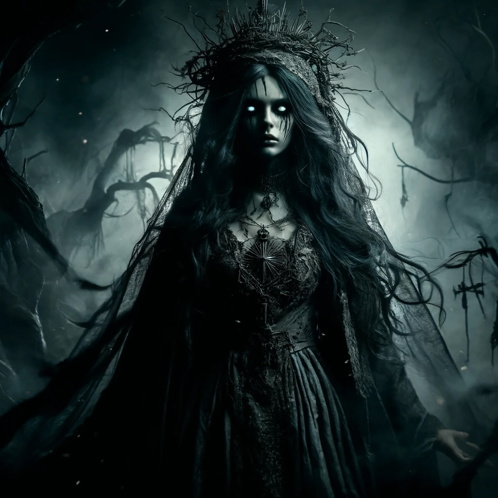

**Alignment**: Chaotic Neutral
**Domains**: Death, Trickery, War
**Symbols**: A crib entwined with thorns, a shadowed heart

## Lore
In an age marked by wars and whispers of curses, the tale of Lamentra begins with a mother named Elyndra whose life was shattered by the mysterious disappearance of her infant son, Milo. Accused unjustly by her fellow villagers of sacrificing her child to dark forest spirits, Elyndra fled into the cursed woods, seeking either solace or madness.

Instead, she found power in the shadows, becoming a vengeful spirit haunting the fringes of civilization. As years turned into decades without a sign of her son, Elyndra's humanity slipped away, leaving behind a deity born of shadows and sorrow. Elevated by the gods of death and darkness, she was transformed into Lamentra, a goddess whose heart was a well of eternal bitterness and vengeance.

## Worship
Lamentra is worshipped in places touched by tragedy and secrecy. Her followers, the Shadow’s Kin, include those wronged by society, seekers of vengeance, and anyone drawn to the power of darkness. Temples dedicated to Lamentra are secluded, often found in the darkest parts of forests or abandoned ruins, where light dares not linger. Rituals in her honor involve secretive ceremonies, often including the exchange of tales of betrayal and the planning of retributive acts.

## Divine Gifts
Priests and devout followers of Lamentra may receive divine gifts such as the ability to see in complete darkness, manipulate shadows, or even communicate with the spirits of the wronged. Her clerics are often granted spells that involve illusions, necromancy, or enchantments that can twist the minds and hearts of others.

## Role in the Campaign
**Antagonist**: Lamentra can serve as a compelling antagonist in a campaign, driving plots of revenge against entire kingdoms or specific powerful figures who have wronged her followers.
**Patron**: For players, Lamentra could be a patron for characters who have a backstory of loss or betrayal, providing them with dark powers aimed at righting the wrongs they have suffered.
**Quest Giver**: She might offer quests to retrieve sacred relics lost in time or to exact vengeance on formidable foes, promising her shadowy aid in return for service.

## Myth
Once a devoted mother, now a deity of shadows, Lamentra’s tale is a stark reminder of the destructive power of unresolved grief and the dark paths it can forge. Her story serves as both a warning and a call to those who feel that justice has eluded them, offering them a divine hand in their darkest moments.

