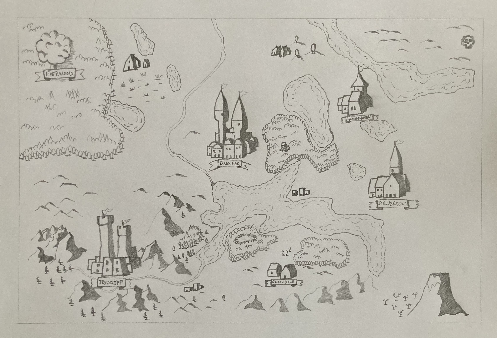

Do I even need a map? I started without, but here's the thing: All the characters in my Gerbil King's Quest Campaign have
ai-generated places they _came_ from. Like Ironcliff for the dwarf and Gloomhaven for the rogue. And since I want to
put the players dead in the center of the campaign like Sly Flourish suggests, well, I kind of need to know where those
places are and be able to show them to the players: Look, that village you defended as part of your origin story, that's Greendale
see? Down there, nestled between the mountains on the left (ahem, west) and those on the other side...

I've always been fascinated with the style of [watabou's](https://watabou.itch.io/) [Perilous Shores](https://watabou.itch.io/perilous-shores).
_That's_ what I want my maps to look like. And I first tried to create a template for [Dungeondraft](https://dungeondraft.net/) to include those stamps.

Long story short: I don't really think I want my maps to be done on the computer. I want to draw them by hand. The whole point of
pen and paper (at least to me) is to, you know, also pen and _paper_. So now I'm just trying to learn by imitating the style by hand.

Mountains watabou style are quite easy to do. Also, the [Perilous Icons](https://watabou.itch.io/icons) tool gives a ton of different city
and towns to copy.

I'm a bit stuck with making forests look good. Currently, this video is inspiring me: [How to Draw Fantasy Map Trees and Forests - 5 easy styles to make your maps look awesome](https://youtu.be/2dXymefWOuc?si=K8GHEfbgfHnQD2is). The third approach is very similar to what watabou does. I guess I'm now subscribed to
[Maps by Owen](https://www.youtube.com/@MapsbyOwen).

Here are some guiding principles that I'm making up on the spot:

- start with any towns, villages etc. that the players come from
- then the big cities
- then mountain ranges
- then lakes
- then forests
- don't forget dungeons and other markers
- fill in some hamlets and lone trees and marshes and stuff like that

This isn't solid advice that's been tested: I'm literally in the process of making my own first map. BUT: This is how I think it _should_ go down. Here's why:

The players are the most important part of the game - no game without players. And they want to know where they're from. Since I used gen-ai to create the 
backstories for the pre-generated characters that the players all ended up taking (easiest for first time players), there were a bunch of towns and forests mentioned
that until I show them my map don't really exist.

Oh. And starting with towns and cities etc. is cool because you can make them comically large using the perilous icons mentioned above. This helps move away from "geography" maps and more to "story" maps: I firmly believe that a point crawl beats a geologically sound map anyday.

Aaanyway. Here's a work in progress:

