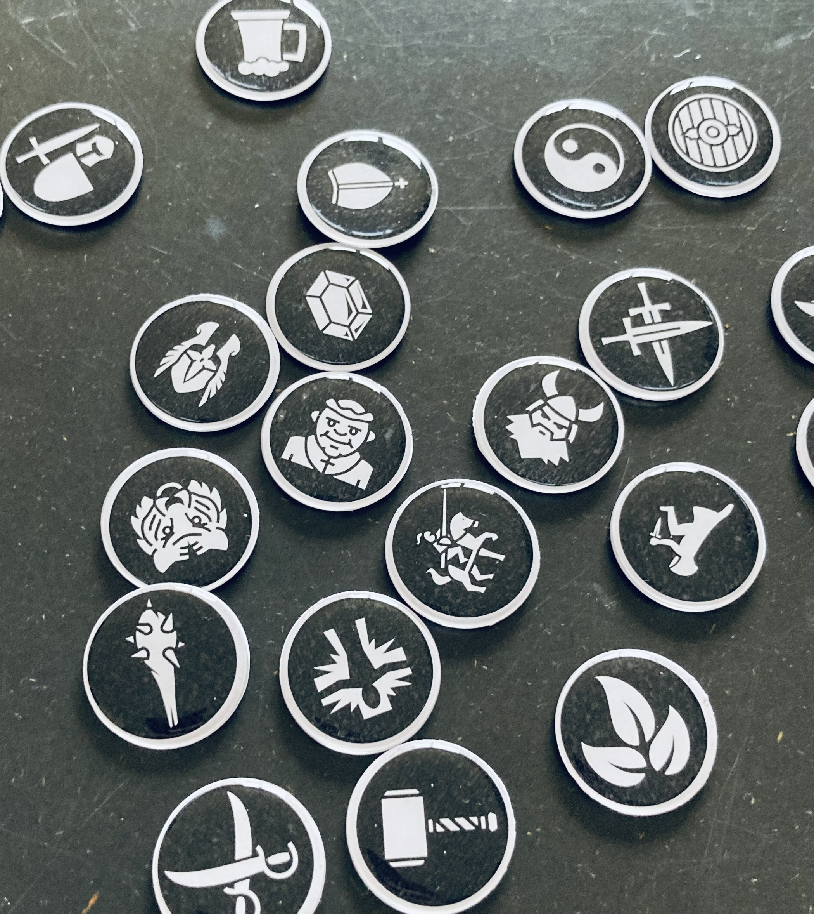

Last weekend, I spent _hours_ going over the tokens at [Game-icons.net](https://game-icons.net/), sifting for those I could use as lazy player tokens, following the guide from Sly Flourish on [Crafting Lazy Monster Tokens for D&D](https://slyflourish.com/crafting_lazy_monster_tokens.html).

I have made the set of monster tokens as described in that article, pasting them back-to-back instead of using the magnets. I like this better than the magnets, which I had also experimented with, because magnets tend to stick together and then the tokens all sort of _clump_ together.

The scheme of the monster tokens by Sly Flourish is black on a white background. So for the player tokens, I've chosen white on a black background, which is also the default on Game-icons.net. The black circle is actually 0.9 inches, so when you cut the tokens out with a 1 inch punch, you'll have a little white border which I think works quite nicely.

Since the icons are offered with the [CC BY 3.0](https://creativecommons.org/licenses/by/3.0/) license, it's only fair I share my derivative work with the same license. 

Here's the PDF containing the tokens: [Lazy Player Tokens](./lazy-player-tokens.pdf). 

I'd like to point out that the term "lazy" here is a nod to [Sly Flourish](https://slyflourish.com/) who's excellent book [Return of the Lazy Dungeon Master](https://shop.slyflourish.com/products/return-of-the-lazy-dungeon-master) has shaped how I view the game. I've ended up buying all his products, so I might just be a biased fan-boy, but... check it out. There's some great content there!!

