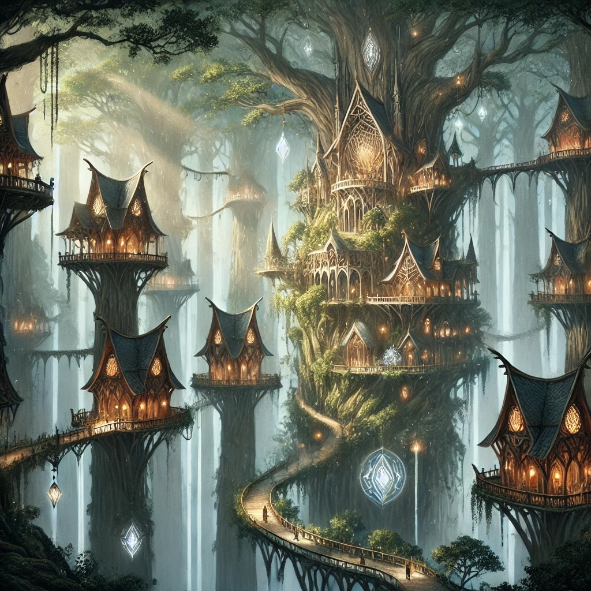

Lirendel is an **elven city** built high in the branches of an ancient grove of **Sequoia trees**. The architecture blends living wood and crystal, which glow softly to illuminate the platforms and bridges shaped by elven magic. Silver ivy forms pathways between homes nestled in the branches, with hanging gardens blooming year-round.

Scholars and druids gather in the **Luminous Library**, where knowledge is stored in the leaves of the trees. At the city's heart stands **Ithilgalad**, an ancient tree where ceremonies and council meetings take place.

Though serene, Lirendel is well-defended by shifting branches and vigilant sentinels. A corps of archers known as the **Lirendel Archers** watch from hidden vantage points, always ready to protect the grove.



## Government 

Lirendel is governed by a Counsel of three elves:
- **Ilanis Naïlo** - female, stern, _ancient_, responsible for managing the wisdom collected in the Ithilgalad
- **Peren Ostoroth** - male, middle aged, hot headed, responsible for the defences of the city
- **Mya** - female child, responsible for the future of elven-kind and contact to the other races

Contrary to expectations many visitors to Lirendel have, Mya is actually the most powerful of the council. This is because the Elves realised long ago that their longevity can lead to getting stuck in their ways of thinking and young Elves are tasked with making sure the Government can respond to new situations appropriately, with the elder members of the council advising. **Peren** secretly would like to have more control, though.

The main government building is structured around the **Ithilgalad**, the oldest and tallest of the Sequoia trees in the middle of Lirendel. The Ithilgalad houses the **Council Court** and the **Library**. It is heavily guarded, though *citizens* of Lirendel can pass in and out freely.
## Underground

Not all inhabitants of Lirendel are considered _citizens_ and thus allowed free access to the knowledge stored in the Ithilgalad. Only Elves are given this status. Half-Elves, ambassadors from other races and especially the large community of **Forest Gnomes** tasked with maintenance and other menial work are considered second-class and have less rights in Lirendel Society.

The Forrest Gnomes have an underground organization, called simply the **Union**. Getting into contact with the Union can be tricky business as they're not strictly a legal institution. Some senior members can be found in **The Burrow**, a pub mainly frequented by Gnomes and other lower-class folk in the poorer parts of Lirendel - in the roots of the Sequoias.

**Greta Waldmut** is the leader of the Union. She is an elderly matron. She isn't planning a revolution. Just... recognition for the work done by the forest gnomes in Lirendel.

## Altars

At the root of the Ithilgalad, there is an entrance to a **grotto**. Inside the grotto is a deep pond that connects Lirendel to the spirit of **Sehanine Moonbow**. The grotto serves as a sacred space for elves of Lirendel to connect with their **goddess of the moon, dreams, and mysteries**. At the edge of the pond is a beautiful, natural altar where offerings are left during times of reflection, change, and celestial events.
## Resources

The main resource in Lirendel is the **Luminous Library** - the wealth of knowledge stored in the leaves of ancient Sequoia trees. Most of the Elves in Lirendel are connected to this library in some way.

The knowledge stored in the Library is not given freely. Instead, **the Elves trade knowledge for resources**, especially materials and products hard to obtain in the forest.

The clerics in the sacred grotto can extract **Elixirs of Health** by combining Moonlight and Sap from the Redwood trees. The Elves feel duty bound to help restore creatures to health that are brought to the grotto - as long as a **pact of non-violence** is kept.
## Defences

The **Lirendel Archers** are famous for their skills with the Elven Longbow. The corps is 100 men strong and they use the Elvish Veteran Archer stats from the Tome of Beasts:

```statblock
creature: Elvish Veteran Archer
```

The **Mists of Memory** makes it very hard (DC 15 INT) for creatures to enter the city without becoming confused and turning back unless guided through. There is an official gate to Lirendel just outside the mists where visitors can request a visa and entry to the city. 

## Social

The elves love to socialise, especially under the light of the moon. These revels include laughter, merriment, music and lightly intoxicating sequoia sap brews.

The other races, except for important guests, are often in the background of these parties. Instead, they tend to congregate in pubs located among the roots of the sequoias, for example the **Burrow**, a pub serving ale and mushroom stew frequented by forest gnomes, including the **Union**, an egalitarian organisation working for the rights of non-elves in Lirendel.

A speciality in Lirendel is their flat bread, a bit like Naan, but light as a feather and spicy, tasting a bit like a combination of cinnamon and maple sirup.

## Important Landmarks in Lirendel

**Ithilgalad**: The central and most sacred tree of Lirendel, the Ithilgalad serves as the heart of the city. It is where important ceremonies are held, council meetings take place, and the city's history is recorded.

**Luminous Libraries**: Located high in the branches, these libraries are unique as they store knowledge in the leaves of the trees themselves. The largest of these libraries is located in the **Ithilgalad** itself,  containing the most valuable and ancient knowledge. Scholars and druids gather here to learn and meditate. The leaves can be read by those attuned to the magic, revealing words and symbols that shift with thought, while writing is done through whispered incantations that imprint knowledge onto the foliage.

**The Hanging Gardens**: A series of gardens suspended along the platforms and bridges, blooming with flowers that change throughout the year. These gardens are a symbol of the elves' harmony with nature and provide herbs and ingredients for both culinary and medicinal purposes.

**Lirendel Archer Outposts**: Hidden along the edges of the city, these outposts are where the Lirendel Archers keep watch. Built seamlessly into the trees, they serve as both lookout points and places of rest for the archers.

**The Crystal Paths**: Bridges and walkways made of living wood intertwined with crystal, these paths glow softly at night, providing light and guiding residents through the city. They are a testament to the craftsmanship of Lirendel's artisans.

**The Mists of Memory**: Surrounding Lirendel, the Mists affect anyone trying to get into the city without permission by wiping their short term memory, leaving them confused and disoriented. Anyone entering the mists that fails a DC 15 INT saving throw will be affected by the mists and get lost in the forest, eventually ending up outside the mists again, but at a random place. There is a Gate in the forest along the road to Lirendel guarded by Lirendel Archers that travellers wishing to enter the city must pass through and where they can obtain a guide through the mists.

**The Grotto**: At the root of the Ithilgalad, there is an entrance to a **grotto**. Inside the grotto is a deep pond that connects Lirendel to the spirit of **Sehanine Moonbow**. This is tended by priestesses that perform rites and help heal creatures brought to the grotto. They also produce **Elixirs of Health** using the unique magic of the grotto and its connection to the godess **Sehanine**.

## Important Figures in Lirendel Society

**Ilanis Naïlo** - _Member of the Council of Lirendel_: Ilanis Naïlo is an ancient, stern Wood Elf. She is responsible for making decisions regarding laws, diplomacy, and city affairs. Known for her **wisdom** and **fairness**, she is a respected figure whose guidance has helped maintain peace and prosperity in Lirendel.

**Peren Ostoroth** - *Member of the Council of Lirendel*: Peren Ostoroth is a middle aged, hot headed Wood Elf. He is responsible for the defences of the city and any matters pertaining to relations to other cities and nations, especially during times of war. He would (not so secretly) like more power and will favour conflict in council decisions that make his position stronger.

**Mya** - *Member of the Council of Lirendel*: Mya is a Wood Elf child. She is repsonsible for the future of Elvenkind and must make any final decisions on the council to ensure that the Elves will prosper. It is customary to have a child in this position, as Elves live very long lives and tend to become very set in their ways of thinking. Mya is very interested in news from outside Lirendel, in adventures, new inventions, fashion, foods and all the things more mortal species keep developing.

**Sylara Eleneth** - _Commander of the Lirendel Archers_: Sylara Eleneth commands the Lirendel Guard, reporting directly to **Peren Ostoroth** and overseeing the city's defences and ensuring the safety of its citizens. Her archery skills are unmatched, and she is known for her dedication to protecting Lirendel from any threats. She counteracts Peren's hot headedness by being a pragmatic and capable senior officer.

**Thalion Galanodel** - _High Keeper of the Luminous Libraries_: Thalion Galanodel is the head of the Luminous Libraries, responsible for preserving the ancient knowledge held within the enchanted leaves. He reports directly to **Ilanis Naïlo**. He oversees the training of scholars and ensures that the city's lore is safeguarded for future generations.

**Maerwen Liadon** - _Mistress of the Hanging Gardens_: Maerwen Liadon oversees the Hanging Gardens, ensuring that they thrive and provide both beauty and sustenance to the city. She is also a skilled herbalist, using her knowledge to provide remedies and advice to those in need.

**Caerthian Ilphelkiir** - _Master Artificer of the Crystal Paths_: Caerthian Ilphelkiir leads the artisans responsible for the construction and maintenance of the Crystal Paths. His expertise in blending magic with craftsmanship has been instrumental in keeping the city illuminated and connected through its intricate network of bridges and walkways.

**Nythera Liadon** - *High Priestess of the Grotto*: A soft spoken, kind hearted middle aged Wood Elf who has dedicated her life to the godess Sehanine.

## Visitor Information and Cultural Etiquette

Visitors to Lirendel are required to have an invitation or sponsorship from a resident. The paths leading to Lirendel are well-protected by the Mists of Memory, and travellers are often guided by members of the Lirendel Archers. It is important to respect the customs of the elves, including remaining quiet during ceremonies, refraining from touching sacred trees without permission, and observing the rituals of hospitality when offered.
## Accommodations and Dining Options

Accommodations in Lirendel are available in the form of guest platforms, designed to provide comfort for non-elven travelers while maintaining harmony with the natural surroundings. These guest lodgings are built into the trees, offering stunning views of the grove. Dining in Lirendel is a communal affair, with meals prepared from ingredients sourced from the Hanging Gardens. Visitors can enjoy elven delicacies such as honeyed blossom cakes, herbal teas, and dishes made from fresh forest herbs and fruits. Lirendel Flatbread is a speciality that should be tried by anyone visiting the city.