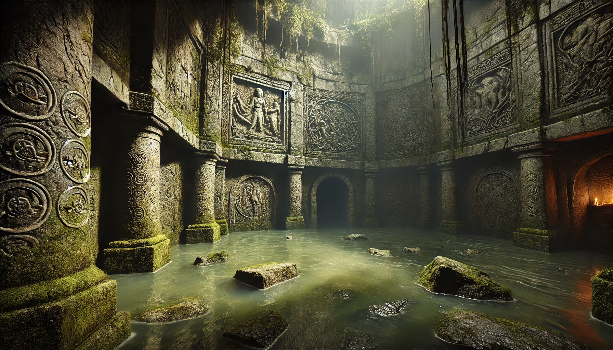
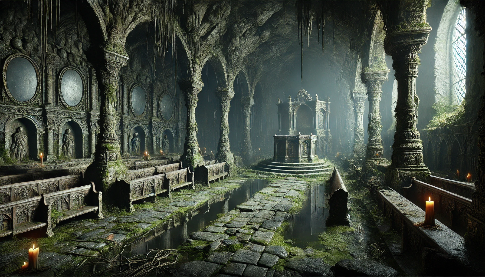
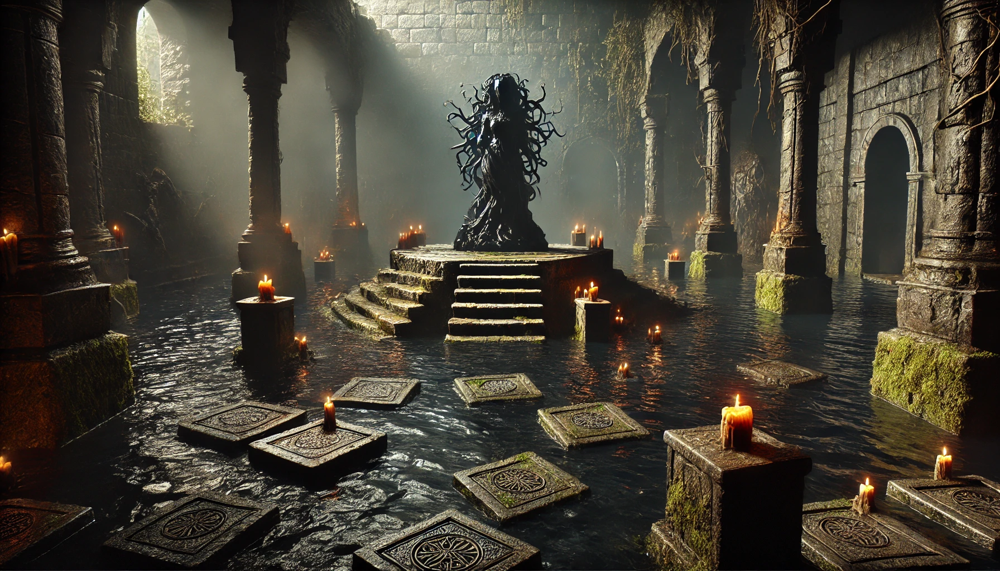
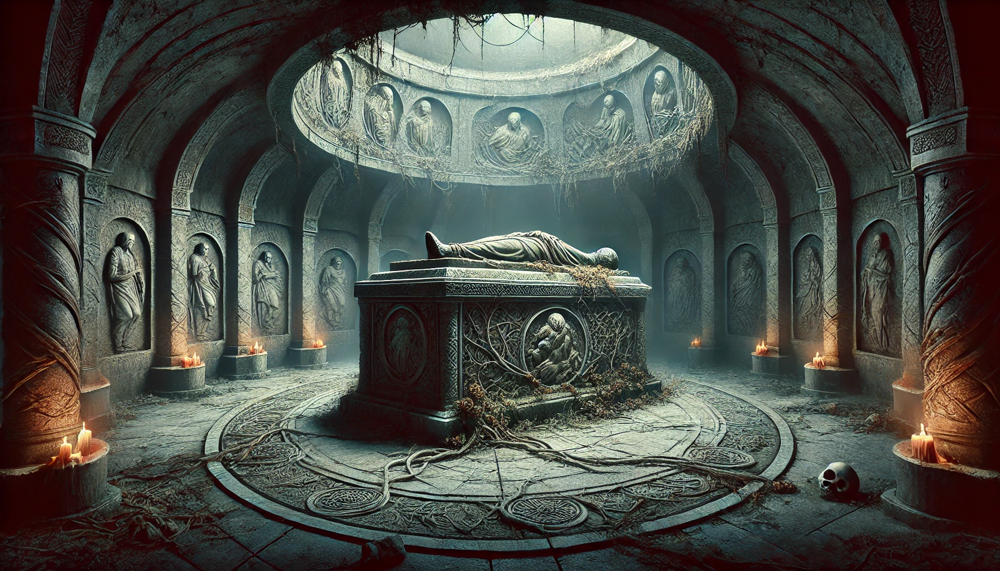

In this [5 Room Dungeon](https://www.roleplayingtips.com/5-room-dungeons/), the adventurers venture into a site long forgotten that used to be a temple to the [Godess Lamentra]().

The main point of this quest is to retrieve an important item at the end of the dungeon. How the player hears about the Sunken Temple of Lamentra and what exactly they need to retrieve can be filled with whatever your campaign needs.

In the case of Thalya Dawnstrider in the Whispers of the Waning Wild, she was sent to the temple to retrieve something, _anything_ that might help gain access to the Realm of Shadows and Sorrow. She also received a long-overdue magic item, her first: A Necklace of Fireballs.

I placed the temple in a swamp, but it can probably also be placed in other locations with enough water for the temple to actually sink into.

The dungeon consists of the following rooms:

- The Waterlogged Antechamber
- The Chapel of Lost Voices and Reflections
- The Sunken Sanctum
- Lamentra's Shrine of Rest

## The Waterlogged Antechamber

A partially submerged stone chamber with cracked walls where vines and moss cover ancient reliefs showing the legend of Lamentra, starting with the death of her son, the accusation, fleeing to the dark forest and her return as a hunter of human souls and bringer of grief. The story is not completely depicted as many parts have withered away. 

The air is thick and damp, and the murky water comes up to knee level.

There are **crocodiles** lurking in the dark waters. Make sure to drag any players grappled by the crocodiles underwater and spin them about like in Crocodile Dundee: Let them come up for air, gasping.

## The Chapel of Lost Voices and Reflections

Rows of **broken pews** face an **altar** upon which rests an **empty, wooden crib**. The walls are covered in faded carvings depicting mortals pleading for mercy. Every few feet, a **polished stone that reflects dim torchlight eerily** adorns the wall, almost as though shadows are watching from every corner. The **floor is slick** (Difficult Terrain) with algae, making movement hazardous.

A haunting presence fills the room. Whispers of Lamentras followers linger here, growing louder and softer intermittently. Any disrespect toward the crib might trigger the presence’s ire. This could be a hauntig leading to the frightened condition on a failed saving throw. Or worse, depending on the nature of the disrespect - maybe even the effects of the **Bane** spell.

The reflection of each character seems to hide a **dark purple flower**. The flower is deadly nightshade and can easily be recognized by anyone with any nature skills. Collecting the flower makes the polished stone become an **corridor to the Sunken Sanctum**.

The **reflections** occasionally manifest as **shadowy duplicates** of the party, trying to pull them into the walls. Characters must make **saving throws (DC 10 WIS)** to resist the pull of their own shadows. A character failing the saving throw will find themself in a room with four walls each a window into the chapel, each showing the same perspective. The floor is black and the ceiling is white. There is nothing else in the room except a purple flower that the character is now holding in their off-hand. The walls can be shattered with a DC 13 Strength check. The character keeps the flower and touching that to one of the other polished stones will open up the corridor.

## The Sunken Sanctum

A deep, flooded room with stepping stones and crumbling pillars. In the center, partially submerged, is an **altar** with an **obsidian sculpture** representing Lamentra, surrounded by **lit candles** that never seem to go out, despite the dampness.

The water here hides a swarm of **poisonous snakes** that will attack anyone who disturbs the altar. Additionally, stepping in the wrong spot (*DC 15 DEX*) triggers a hidden, necrotic trap that lashes out with shadowy tendrils (*1d6 necrotic*). The stepping stones contain engravings of deadly nightshade leaves, all pointing towards the center, except for a few pointing towards the entrance to the chamber.

Reaching the sculpture and touching it will drain the floor and show a **stairway leading down**. You can describe the obsidian sculpture as folding in on itself, piece by piece and unfolding into the stairs, with very sharp edges.

## Lamentra's Shrine of Rest

At the end of the temple lies a **dark, circular room** with a **massive stone sarcophagus in the center**. The tomb is overgrown with **thorny vines**. The air here is cold and heavy with the **scent of decaying flowers**. Ancient bones of previous followers lie scattered across the floor, covered in **thick layers of dust and mold**.

A final guardian spirit, a **specter** devoted to the Lamentra, rises to defend the shrine. It will only allow characters to pass if they can show proper reverence to the godess' sorrow or defeat it in combat. The specter used to be a Paladin named **Rolor** and does not quite understand he's dead yet.

If the battle seems too easy, the bones can assemble into waves of **skeletons**. They also have loot on them.

## Example Reward

An ancient scroll detailing The Ritual of the Shadow Reflection that can be used to open a portal to the Realm of Shadows and Sorrow. The ingredients for this ritual provide more quests.

One of the bones is a broken piece of a lower jaw engraved with a strange writing. The bone is faded to a dark yellow, but the engraving seems fresh.