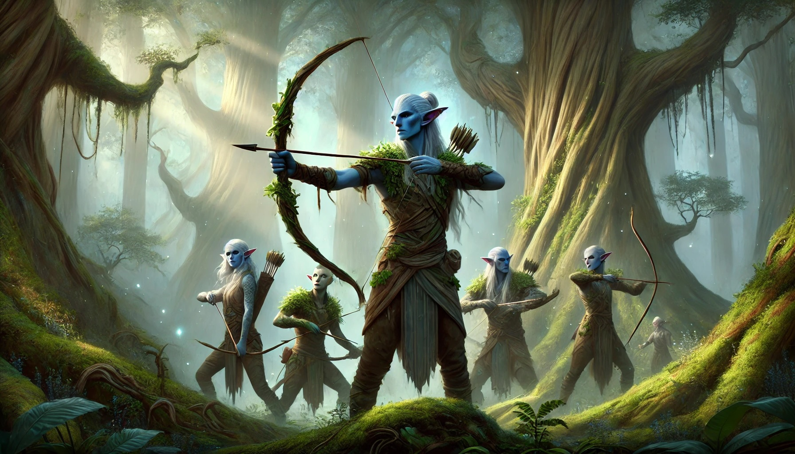

The People of the Forest are a tribe of Firbolg dedicated to protecting an enchanted forest known as **the Seam** that connects the material plane with the plane of Faerie. Since the forest spans both planes, the People of the Forest end up wandering both planes and are accustomed to slipping from one world to the next, finding crossovers where others wouldn't notice them.

### The Last Stand at the Gate of the Forest

Centuries ago, the People of the Forest were tasked with guarding a fabled portal known as the Gate of the Forest - a rare passage between the Material Plane and the The Plane of Faerie. Legends speek of the rise of **Kazq'athar**, an ambitious warlock who amassed an army to seize this gate’s arcane power, threatening to overrun the forest and shatter the balance between worlds.

Ordered to hold the line, most of the Firbolg defenders stood firm. But when the enemy surged forward in overwhelming numbers, panic spread. A large contingent deserted their posts, leaving their comrades outnumbered. In the final clash, the Gate itself collapsed in a burst of unstable magic, claiming the lives of defenders and invaders alike. The wild energy unleashed corrupted the woodland, spawning a host of malevolent beasts and giving rise to the dreaded Dark Tiger - a restless spirit of vengeance prowling the forest to this day.

Those few Firbolg who survived, shamed by their moment of cowardice, vowed to remain in the forest forevermore. Naming themselves the People of the Forest, they devote their lives to mending the damage wrought by the Gate’s destruction, patching planar rifts, and warding off evil creatures that lurk among the ancient trees. Though their ancestors’ failure haunts them still, these Firbolg endure as patient, silent sentinels between two worlds - ever watchful, ever atoning.

### The Prowler in the Dark

The Prowler in the Dark is a manifestation of some of the energy released when the Gate of the Forest imploded. Most simply refer to it as the **Dark Tiger**. The name is whispered with dread throughout the forest, recalling the primeval ferocity that still stalks the ancient glades. This is the arch enemy of the People of the Forest and they are forever vigilant, keeping tabs on the whereabouts of the dark power, chipping away at the edges, where it manifests as goblins and other evil creatures of the forest.

### Organization

In order to be able to patrol the whole of the Seam, the tribe is split into multiple camps. The leader of a camp is chosen by the camp's people and is usually the most experienced hunter or magic user and always someone trusted by the whole camp. The People of the Forest do not distinguish between male roles and female roles, and this reflects in their choices for the leaders as well, with both genders being equally likely to lead a camp.

The camp leaders use a special stone called the singing stone to communicate over long distances and between the two planes with the other leaders, allowing them to coordinate hunts for evil creatures but also defenses and other tribe matters.

### Figures of Interest

- **Oak standing tall in the wind** - the famous  camp leader of the **Acorn Camp** is known for his strong opinions on dealing with "outsiders": They should go back to where they came from. He is fair, though, and will honor oaths, promises and laws where applicable. He cares deeply for his people and sees the task of the tribe as a holy, generation-spanning quest.
- **Willow bending in the wind** -  used to be Oak's wife. They parted ways a long time ago over a dispute on how to raise their son **Leaf** with Oak pushing Leaf to show his courage in the face of danger and Willow suggesting a more sensible approach. Leaf has not been seen since he left on a quest Oak urged him to undertake and Willow left the camp shortly after, forming her own camp, the **Berries Camp**, that guards the edges of the forest, while keeping an eye out for Leaf.

### Traits & Tactics

- **Archery Expertise.** The tribe is famed for its **Forest Bows**, which require a Strength of 13 to use and deal an **additional +1 piercing damage**. These bows are **grown from living wood** gleaned from a special glade in the forest, making them nigh-unbreakable. They do not count as magical.
- **Stealth & Pack Tactics.** The People of the Forest move silently through the forest, blending into the forest undergrowth, to the point that even skilled trackers can’t see or hear them approach. They **signal each other** with birdcalls, druidic whispers, or subtle illusions gleaned from their connection to Fey magic.
- **Harassment & Hit-and-Run.** Rather than pitched battles, they prefer **ambushes** - firing from the treetops, then **melting away** into twisting pathways that lead deeper into the forest or even into the Plane of Faerie.

### Random names

Use the following table for generating random NPC names for People of the Forest:

| d20 | First name | Trait          | Family             |
| --- | ---------- | -------------- | ------------------ |
| 1   | Oak        | Standing Tall  | In the Wind        |
| 2   | Willow     | Bending        | Beside the River   |
| 3   | Ash        | Reaching High  | Among the Stars    |
| 4   | Pine       | Whispering     | Through the Trees  |
| 5   | Maple      | Blazing        | Under the Sun      |
| 6   | Birch      | Shimmering     | At Dawn            |
| 7   | Cedar      | Rooted         | In the Shadows     |
| 8   | Elm        | Shelter-Giving | On the Hill        |
| 9   | Hawthorn   | Thorned        | By the Path        |
| 10  | Ivy        | Climbing       | Up the Wall        |
| 11  | Yew        | Enduring       | Through the Ages   |
| 12  | Rowan      | Guiding        | Through the Mists  |
| 13  | Fox        | Cunning        | In the Glade       |
| 14  | Bear       | Lumbering      | Across the Valley  |
| 15  | Wolf       | Howling        | Beneath the Moon   |
| 16  | Stag       | Bounding       | Over the Stream    |
| 17  | Sparrow    | Chirping       | Among the Branches |
| 18  | Owl        | Watching       | Through the Night  |
| 19  | Eagle      | Soaring        | Over the Mountain  |
| 20  | Raven      | Calling        | Beyond the Horizon |

Roll 3d20 to generate a random name by combining one entry from each column.
