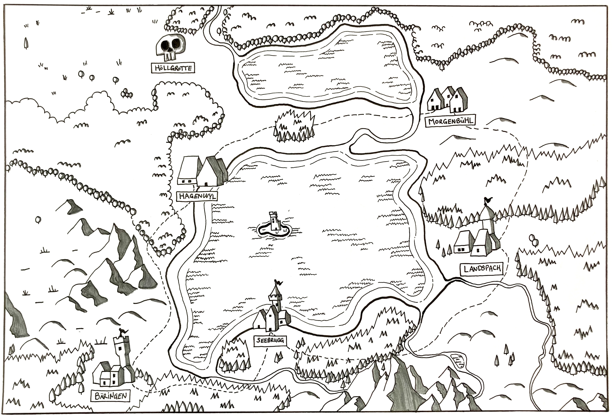

In my mind, Dungeons & Dragons is something that happens in English. I make sure to get the English version of the books. I consume blogs and youtube videos on the topic in English. I think about my game and prep session notes in English.

But most of the groups I play with are more comfortable playing in Swiss German. Most groups will have at least one player who isn't comfortable enough playing in English. And that got me thinking.

I have since accepted, that I need to learn how to play the game in "Schwiitzerdütsch" and I've also accepted that this is a great idea! 

Swiss German is primarily a _spoken_ language without a standardized grammar and spelling rules. Those would be very hard to define, as its not a language per se, but rather a collection of related dialects, each very different in pronunciation and variances in vocabulary. Texting in Swiss German across dialect boundaries can be challenging! And so, officially, Swiss Standard German is used for written communication - something Germans and Austrians can immediately understand with differences at the scale of... British English vs. American English: Some minor spelling differences and some vocab stuff. The difference between an apartment and a flat is similar to the difference between "Gehsteig" or "Bürgersteig" (High German) and "Trottoir" (Swiss German, borrowed from French). Swiss German speakers learn Swiss Standard German as the main language for reading and writing in school.

But that's not how Swiss Germans _think_. They think in their dialect and... that's a _good_ thing when it comes to role playing: RP is something that happens in the moment. It's not _meant_ to be written down. It's a performance. And it's _spoken_.

There are a bunch of things that flow from this:

First, for a place to be "home", a place the player characters can come from, it needs to be pronounceable. Sure, fantasy settings will always have those strange names that sound like far far away. But there are also the other names. The "Shire", "Bag End", the little towns and rivers and valleys that are for normal folk, the kind of place that isn't infested by dragons. The kind of place worth saving from evil.

Having these places "work" in your native tongue is valuable, as it communicates a bunch of stuff. The Shire is something we can reason about, because we have some ideas about what living in rural England might be like. We have some ideas about how society might be structured and we're not surprised that a Baggins might have a gardener.

For my campaigns, therefore, I need the Swiss German equivalents. Enter Hagenwyl, Bäringen, Seebrugg, Landspach, Morgenbühl: These are places that are easy to pronounce in Swiss German. They evoke a certain imagery for people familiar with how these names work. They are a starting place for levels 1-4, something to explore that isn't the plane of Fairie or the Abyss, something that can be understood and that can be used as a contrast to the reality bending magic that is about to throw everything into peril.

Second, I need to start collecting names. I've already written an [article on names]()
 that are either Swiss German or sound similar enough that they can pass as Fantasy German.

Third, I'll need to start collecting vocabulary and phrases for describing the world in Swiss German. How to describe a dungeon? How to describe a Manticore? These things still need to be figured out and I guess I might end up writing some posts on this.

