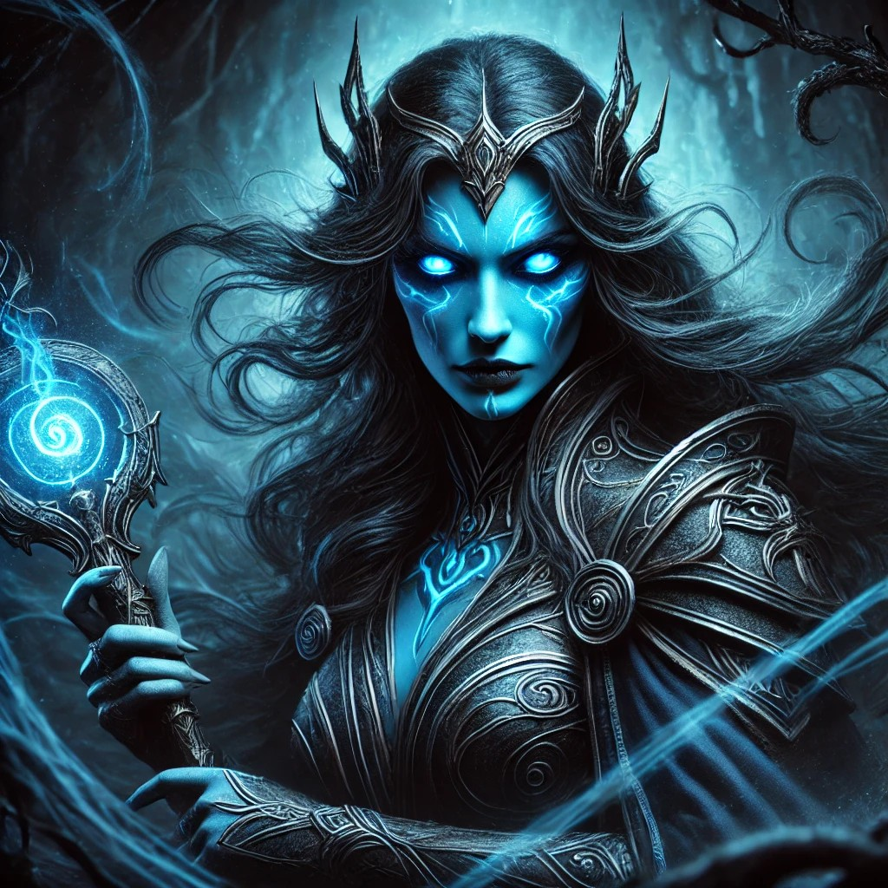

I stumbled upon the following link and need to remember it:  [Random Myth Generator](https://sites.google.com/view/myth-generator/home) by Chris Francis. That link will take you to a very simple page: It's a giant button that says  "Random Myth Article" and clicking on it will take you to a random Wikipedia article. Some examples you might get directed to:

- [Changeling](https://en.wikipedia.org/wiki/Changeling)
- [Atlantis](https://en.wikipedia.org/wiki/Atlantis)
- [Púca](https://en.wikipedia.org/wiki/P%C3%BAca)

That list was generated by clicking on the button three times in a row. I haven't read the articles yet, but you can bet I will - especially since one of the characters in the Team Magic campaign is playing a Changeling!

I was able to extract the full list pretty easily using ChatGPT, but I won't be posting it here, since that's Chris Francis' work and I don't want to steel his stuff except to put in my private notes. Also, the randomness of clicking on the button is just way more fun.

Here's a fun game to play: Choose three random myths from the generator, like I did above. Then, try and distill 3 story archetypes from each of those pages. Then pick one each that seems interesting and sparks your creativity.

So, _Changeling_ becomes an outsider seeking belonging - a character struggling with their identity, never fully fitting into one world or another. _Púca_ becomes a bargain with the unknowable - someone makes a deal with a mystical force, only to later realize the consequences are not as they expected. _Atlantis_ becomes the chosen heir of a lost civilization - a protagonist discovers they are the last link to a fallen empire, tasked with reviving or redeeming its legacy.

This is a bit like playing with tarot cards.

How do we weave that into an interesting piece of world-building? While the step above can easily be done with ChatGPT, the next step is should be something you develop yourself: That way, it becomes _yours_. Here's one attempt:

This is the backstory of a powerful villain. Let's give her a name: **Yrsa Tanithvellar**. While I don't have time to flesh it all out right now, here are some points where this might go:
- dropped off at the doorstep of a childless couple in a rural village as a baby
- spent a lot of time at the small river behind the house listening to the water
- eventually started hearing a voice telling her to go seek the source of the river
- the source used to be a powerful temple to an evil god and Yrsa just happens to be descendant from the original cult members who had been defeated hundreds of years ago
- the evil god promises her great power if she restores the cult back to it's original power
- wielding this power slowly corrupts her, while granting her imortality

I don't know. This is just off the top of my head. But you can see that a lot of fun can be had by re-mixing these ideas. I love this little myth generator!!

