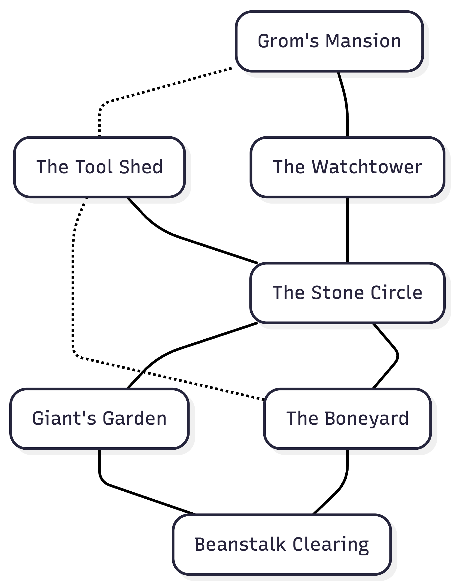

Today, I'm a little disappointed. I was very excited about becoming an adventure publisher. Especially after reading [M. T. Black's The Anatomy of Adventure](https://www.mtblackgames.com/work/anatomy-of-adventure-second). I saw myself happily writing adventure after adventure in my free time, posting them here.

Until I sat down to do it yesterday - I've had this little adventure stuck in my mind for quite a while: Grom's Mansion in the Clouds. Sometimes I call it Grom's Castle in the Clouds. It's a side quest I intend Thalya Dawnstrider, my partner's Druid Half-Elf character in our on-going Duet campaign, to explore. She was given a little wooden box, intricately carved containing 5 beans. Thalya hasn't planted them yet, so the adventure hasn't kicked off yet, but when she does, a mighty beanstalk will grow and reach the clouds, climbing it will lead her to the land of faerie, in the realm of Grom, a mighty **hill giant**. You've already noticed, that I'm stealing liberally from [Jack and the Beanstalk](http://en.wikipedia.org/wiki/Jack_and_the_Beanstalk).

My plan was to flesh out my notes into a whole little adventure and publish it.
I've always had plans like these - they're comfortable fodder for a mind that likes to think about stuff. And RPGs are a great topic to think about, with many overlapping hobbies interacting. I'd draw a map. I'd learn to draw so that I can show pictures of the various locations. I'd figure out my printing pipeline to go from [Markdown to PDF](http://en.wikipedia.org/wiki/Jack_and_the_Beanstalk).

So why is this a blog entry, and not a published adventure?

As I sat down to actually write up the adventure, I got incredibly bored. Writing is hard work. Dreaming of being a writer is much easier.

Instead of being a writer, I've decided to just write. Today, I'm going to write about the main parts of the adventure. This isn't in a fancy adventure format, or one of Sly Flourish's scenarios - though you should definitely [become a patron of Sly Flourish](https://www.patreon.com/c/slyflourish) to get hold of those, they're great! Instead, I'm just going to spend the next few blog posts talking about the different parts of the adventure. Fleshing them out. And since nobody but me ever reads this blog, I won't have to worry about getting everything right, everything just so.

## Location overview

Here's an overview of the various locations. I'll be describing the various locations each in a post of their own:

