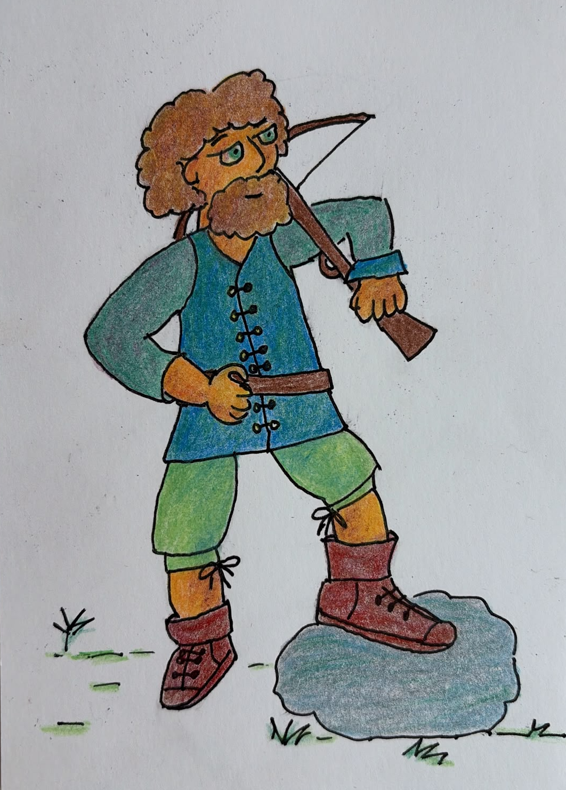

Well. I had this whole vision of the art style for Oaths of the Waldstädten. And it was glorious! It was completely AI-generated, of course. An exploration of what the cover of a campaign setting zine might look like. A hint at what a helvetic fantasy style should portray.

Reality hit me in the guts: My drawing skills are nowhere close. So this is what we're working with.

Yeah. I'm not saying I'm not proud of the little guy. I am. A lot. I've been working up to this level since at least a year now.

It does change how I'm thinking about this project, though.

I understand that I won't be doing a kickstarter anytime soon. I won't be hiring copy editors and whatnot. We're not there yet.

Where we are right now is not zero either: I have a bunch of wikipedia articles I find fascinating. I have access to a _bunch_ of TTRPG information and knowledge. And I have a blog. The blog is key. If I want this project to go anywhere, I'll have to build it in the open. One article at the time. One drawing at a time. And a bunch of other things in between.